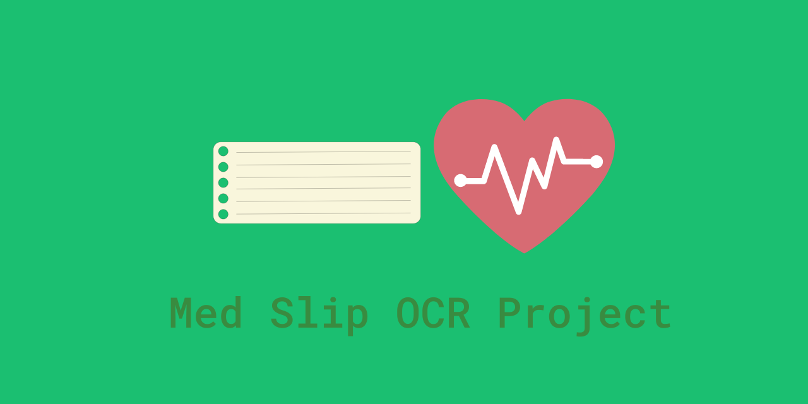

<div align="center">

<h3 align="center">Med Slip OCR Project</h3>
<p>This project is created and developed at Botnoi during the Super AI Engineer Internship.
</p>
    
</div>

<!-- TABLE OF CONTENTS -->
<details>
  <summary>Table of Contents</summary>
  <ol>
    <li>
      <a href="#about-the-project">About The Project</a>
      <ul>
        <li><a href="#built-with">Built With</a></li>
      </ul>
    </li>
    <li>
      <a href="#getting-started">Getting Started</a>
      <ul>
        <li><a href="#installation">Installation</a></li>
      </ul>
    </li>
    <li><a href="#usage">Usage</a></li>
    <li><a href="#roadmap">Features</a></li>
    <li><a href="#contact">Contact</a></li>

  </ol>
</details>


<!-- ABOUT THE PROJECT -->
## About The Project

[![Product Name Screen Shot][product-screenshot]](https://example.com)

Med Slip OCR is an AI-powered project developed during the Super AI Engineer Internship at Botnoi. The project uses object detection and OCR techniques to read numbers from medical slips, making the process faster, more accurate, and less prone to human error. The web application developed using Streamlit is user-friendly and provides an accessible interface for users to upload one or more images of medical slips and get the output in real-time.

<p align="right">(<a href="#readme-top">back to top</a>)</p>


### Built With

* 
* 
* 
* 


<p align="right">(<a href="#readme-top">back to top</a>)</p>


<!-- GETTING STARTED -->
## Getting Started

This is an example of how you may give instructions on setting up your project locally.
To get a local copy up and running follow these simple example steps.


### Installation

1. Clone the repo
```sh
git clone https://github.com/pangineering/med-slip-ocr.git
```
2. Install all required libraries
```sh
pip install -r requirements.txt
```

<p align="right">(<a href="#readme-top">back to top</a>)</p>

<!-- USAGE EXAMPLES -->
## Usage

Use this space to show useful examples of how a project can be used. Additional screenshots, code examples and demos work well in this space. You may also link to more resources.

_For more examples, please refer to the [Documentation](https://example.com)_

<p align="right">(<a href="#readme-top">back to top</a>)</p>


## Features

- Upload multiple images
- Detect types of text in the images and crop out the detected parts
- Read the text using EasyOCR


<!-- CONTACT -->
## Contact

[](pangineering@gmail.com)
[](https://twitter.com/pangineering)


<p align="right">(<a href="#readme-top">back to top</a>)</p>

---
 [](https://buymeacoffee.com/pangineering)  

 [](https://ko-fi.com/pangineering)
    <!-- Proudly created with GPRM ( https://gprm.itsvg.in ) -->
  [](PayPal.Me/pangineering6415)
